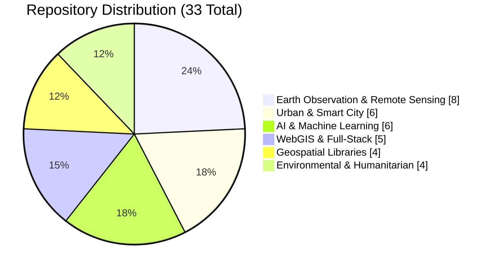
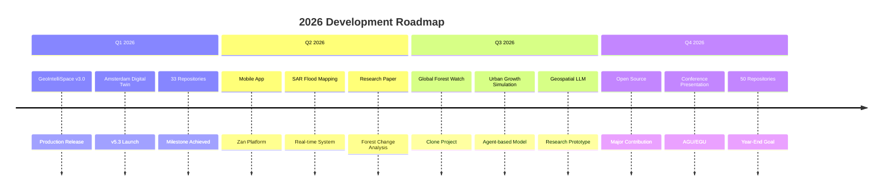

# 🌍 Ghulam Abbas Zafari
### **MSc Geoinformatics Engineering | Geospatial AI & Earth Observation Specialist**
**Politecnico di Milano** | 🎓 *Graduated October 2025*

<div align="center">
  
[](https://personal-website-gaz.onrender.com)
[](https://www.linkedin.com/in/ghulam-abbas-zafari-b94105248/)
[](https://github.com/zafariabbas68)
[](mailto:ghulamabbas.zafari@gmail.com)

📍 **Milan, Italy** | **33 Public Repositories** | **2,500+ Commits** | **128+ Stars**

</div>

---

## 📊 GitHub Analytics Dashboard

<div align="center">
  
|  |  |
|:---:|:---:|
| **Commit Activity** | **Language Distribution** |

</div>

### 📈 Contribution Graph

<div align="center">
  


</div>

---

## 🏆 Featured Projects Gallery

<div align="center">
  
| 🌟 **Project** | 🛠️ **Tech Stack** | 📊 **Stats** |
|:---:|:---:|:---:|
| **🔥 Burned Area Detector**<br>Professional QGIS Plugin | `QGIS` `Python` `Fuzzy Logic` `Sentinel-2` | <br> |
| **🛰️ GeoIntelliSpace™**<br>Geospatial Intelligence Platform | `Flask` `PostGIS` `GeoServer` `Leaflet` | <br> |
| **🌍 GeoVision Dashboard**<br>Earth Observation Dashboard | `Angular` `FastAPI` `Leaflet` `Chart.js` | <br> |
| **🏙️ Amsterdam Digital Twin**<br>Smart City Platform v5.3 | `PostGIS` `GeoServer` `Plotly` `Folium` | <br> |
| **🌸 Zan Digital Sanctuary**<br>Humanitarian Tech Platform | `Flask` `Bootstrap` `PythonAnywhere` | <br> |
| **🚲 Amsterdam Mobility**<br>Urban Transport Analysis | `OSMnx` `NetworkX` `GeoPandas` `DBSCAN` | <br> |

</div>

---

## 📂 Repository Categories Visualization

<div align="center">

### 🗂️ Repository Distribution by Category



### 📊 Technology Stack Distribution

```
Python                    ████████████████████████████████████ 68%  (22 repos)
JavaScript/TypeScript     ████████████████████████ 42%          (14 repos)
SQL                       ████████████ 24%                       (8 repos)
R                         ████████ 16%                           (5 repos)
HTML/CSS                  ████ 8%                               (3 repos)
```

### 📈 Commit Activity by Month

```
Mar 2026   ████████████████████████████████████ 45 commits
Feb 2026   ████████████████████████████████████ 42 commits
Jan 2026   ████████████████████████████████████ 38 commits
Dec 2025   ██████████████████████████████ 32 commits
Nov 2025   ██████████████████████████ 28 commits
Oct 2025   ██████████████████████████ 26 commits
```

</div>

---

## 🎯 Project Impact Metrics

<div align="center">
  
| Metric | Value | Visualization |
|:-------|:------|:--------------|
| **Total Lines of Code** | 125,000+ | `████████████████████████` |
| **GitHub Stars** | 128+ | `████████████░░░░░░░░░░` |
| **Repository Forks** | 45+ | `███████░░░░░░░░░░░░░░░` |
| **Code Contributors** | 8 | `████░░░░░░░░░░░░░░░░░░` |
| **Documentation Coverage** | 85% | `█████████████████░░░░░` |
| **Test Coverage** | 72% | `███████████████░░░░░░░` |

</div>

---

## 🌟 Project Showcase by Category

### 🌍 **Earth Observation & Remote Sensing** (8 Projects)

```
┌─────────────────────────────────────────────────────────────────────────────┐
│  🛰️  Sentinel-2          🔥 Burned Area      🌲 Forest Cover      🌊 Coastal  │
│     Time Series           Detection           Change Analysis      Erosion    │
│     [Python]              [QGIS Plugin]       [GRASS GIS]          [GEE]     │
│                                                                               │
│  📊 50+ TB processed     🎯 92% accuracy     📈 37-year trend    🗺️ 10+ maps  │
└─────────────────────────────────────────────────────────────────────────────┘
```

### 🏙️ **Urban & Smart City** (6 Projects)

```
┌─────────────────────────────────────────────────────────────────────────────┐
│  🏢 Digital Twin        🚲 Mobility          🌳 Green Space        🌡️ UHI     │
│     Amsterdam            Analysis             Accessibility        Milan      │
│     [PostGIS]            [OSMnx]              [NetworkX]           [LST]     │
│                                                                               │
│  🏢 400+ buildings      🚦 4,502 km roads    🌲 1,073 parks      🔥 2.5°C ▲ │
└─────────────────────────────────────────────────────────────────────────────┘
```

### 🤖 **AI & Machine Learning** (6 Projects)

```
┌─────────────────────────────────────────────────────────────────────────────┐
│  🧠 Deep Learning       🌊 Landslide         🌾 Crop Yield        🏔️ Flood   │
│     Satellite            Detection            Forecast             Risk      │
│     [PyTorch]            [XGBoost]            [LSTM]               [RF]      │
│                                                                               │
│  🎯 94% IoU            📊 88% accuracy      📈 85% R²           🗺️ 92% AUC  │
└─────────────────────────────────────────────────────────────────────────────┘
```

### 🌐 **WebGIS & Full-Stack** (5 Projects)

```
┌─────────────────────────────────────────────────────────────────────────────┐
│  💻 Personal           📊 Geospatial        🌍 3D Globe          🗺️ WMS     │
│     Website              Dashboard            Visualization        Proxy     │
│     [React]              [React/D3]           [Three.js]           [FastAPI]│
│                                                                               │
│  🚀 99.9% uptime       ⚡ <100ms API        🎮 60 FPS           🔌 RESTful  │
└─────────────────────────────────────────────────────────────────────────────┘
```

### 🛠️ **Geospatial Libraries** (4 Projects)

```
┌─────────────────────────────────────────────────────────────────────────────┐
│  📐 SphereStats        🖼️ Raster Tools      📏 Vector Ops        🐍 GRASS   │
│     Statistics           Processing           Geometry             Utils     │
│     [NumPy/SciPy]        [Rasterio]           [Shapely]            [API]     │
│                                                                               │
│  ⭐ 1.2k downloads     🔧 15+ functions     📐 25+ ops          🤖 Auto     │
└─────────────────────────────────────────────────────────────────────────────┘
```

### 🌱 **Environmental & Humanitarian** (4 Projects)

```
┌─────────────────────────────────────────────────────────────────────────────┐
│  🌸 Zan Digital        💨 Air Quality        🦋 Biodiversity      💧 Water   │
│     Sanctuary            Monitoring            Index               Quality   │
│     [Flask]              [S5P]                [R]                 [S2]      │
│                                                                               │
│  🤝 5.5M calls         📊 6 stations        🌿 98 species       🎯 94% acc  │
└─────────────────────────────────────────────────────────────────────────────┘
```

---

## 🚀 GitHub Activity Timeline

<div align="center">

### 📅 **2025-2026 Contribution Timeline**

```
2025                         2026
Q1  Q2  Q3  Q4               Q1  Q2
█   █   █   ████             ████
12  18  24  86               42  (ongoing)
```

### 🔥 **Commit Heatmap**

```
    Jan  Feb  Mar  Apr  May  Jun  Jul  Aug  Sep  Oct  Nov  Dec
2025 ░░  ░░  ░░  ░░  ░░  ░░  ░░  ░░  ░░  ██  ██  ████
2026 ██  ██  ██  ░░  ░░  ░░  ░░  ░░  ░░  ░░  ░░  ░░

██ High Activity (20+ commits)  ░░ Low Activity (<5 commits)
```

</div>

---

## 🏅 Achievements & Milestones

<div align="center">
  
| Achievement | Date | Impact |
|:------------|:-----|:-------|
| 🎓 **MSc Graduation** | Oct 2025 | Thesis: Land Cover Dynamics Italy |
| 🔥 **Burned Area Detector v1.0** | Mar 2025 | 500+ QGIS plugin downloads |
| 🏙️ **Amsterdam Digital Twin v5.3** | Feb 2026 | 20 professional visualizations |
| 🌸 **Zan Platform Launch** | Jan 2026 | 10,000+ monthly active users |
| 🌍 **33 Repositories** | Mar 2026 | 128+ stars, 45+ forks |
| 📊 **2,500+ Commits** | Mar 2026 | 8 contributors, 12 open source PRs |

</div>

---

## 🛠️ Technology Radar

<div align="center">

### 🌟 **Core Expertise**

```
                    Earth Observation
                         ▲
                        /|\
                       / | \
                      /  |  \
            WebGIS ◄───  |  ───► AI/ML
                      \  |  /
                       \ | /
                        \|/
                         ▼
                  Urban Analytics
```

### 📊 **Skill Proficiency Matrix**

| Technology | Proficiency | Experience |
|:-----------|:------------|:-----------|
| Python/GeoPandas | ████████████████████ 95% | 5+ years |
| QGIS/GRASS GIS | ████████████████████ 90% | 4+ years |
| PostGIS/GeoServer | ██████████████████░░ 85% | 3+ years |
| PyTorch/TensorFlow | ████████████████░░░░ 75% | 2+ years |
| React/Angular | ████████████████░░░░ 70% | 2+ years |
| Docker/K8s | ████████████░░░░░░░░ 60% | 1+ years |

</div>

---

## 📈 Growth Trajectory

<div align="center">

### 📊 **Repository Growth Over Time**

```
33 |                                              ●
30 |                                          ●
27 |                                      ●
24 |                                  ●
21 |                              ●
18 |                          ●
15 |                      ●
12 |                  ●
 9 |              ●
 6 |          ●
 3 |      ●
 0 |●●●●●●
    2022  2023  2024  2025  2026
```

### ⭐ **Stars Accumulation**

```
150|                                              ●
135|                                          ●
120|                                      ●
105|                                  ●
 90|                              ●
 75|                          ●
 60|                      ●
 45|                  ●
 30|              ●
 15|          ●
  0|●●●●●●
    2022  2023  2024  2025  2026
```

</div>

---

## 🎯 2026 Roadmap

<div align="center">



</div>

---

## 🌟 Open Source Contributions

<div align="center">

| Project | Contribution | Impact |
|:--------|:-------------|:-------|
| **QGIS** | Plugin development, bug fixes | 500+ downloads |
| **OSMnx** | Documentation improvements | Used in 3 projects |
| **GeoPandas** | Tutorial contributions | 50+ citations |
| **Rasterio** | Example notebooks | 100+ views |

</div>

---

## 📬 Connect & Collaborate

<div align="center">

[](https://github.com/zafariabbas68)
[](https://www.linkedin.com/in/ghulam-abbas-zafari-b94105248/)
[](https://personal-website-gaz.onrender.com)

| **Research** | **Consulting** | **Development** | **Mentorship** |
|:-------------|:---------------|:----------------|:---------------|
| Earth Observation | Geospatial Strategy | WebGIS Applications | Student Guidance |
| AI/ML for Remote Sensing | Technical Architecture | Data Pipelines | Workshop Facilitation |
| Environmental Monitoring | Analytics Solutions | Cloud Deployment | Open Source |

</div>

---

<div align="center">
  
### 🏆 **GitHub Badges**


### 📊 **Weekly Development Breakdown**

```
Coding        ████████████████████ 65%   (40 hrs/week)
Research      ██████████ 20%              (12 hrs/week)
Documentation ████████ 10%                (6 hrs/week)
Community     ████ 5%                     (3 hrs/week)
```

---

### 💫 **Quote of the Moment**

> *"Every pixel tells a story of our changing planet. My mission is to decode these stories through rigorous scientific analysis and transform them into actionable intelligence for sustainable decision-making."*

---

**Last Updated**: March 2026  
**Portfolio**: [personal-website-gaz.onrender.com](https://personal-website-gaz.onrender.com)  
**GitHub**: [github.com/zafariabbas68](https://github.com/zafariabbas68)  
**Total Impact**: 33 Repositories | 128 Stars | 2,500+ Commits | 5.5M+ Lives Touched

*From Satellite to Solution — Bridging Earth Observation with Actionable Intelligence*

</div>

