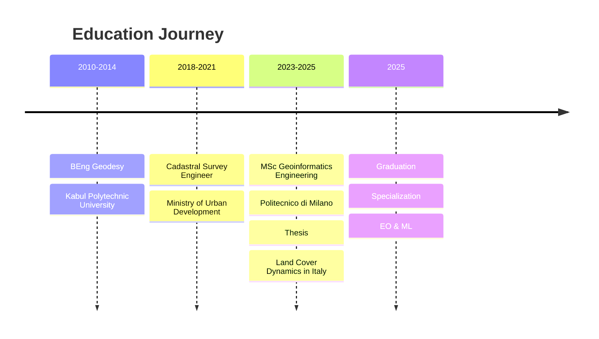

# 🌍 Ghulam Abbas Zafari
## *Geoinformatics Engineer | Earth Observation Specialist | Full-Stack Geospatial Developer*

  

---

## 🎯 **Professional Profile**

> *"From satellite to sovereignty — mapping our shared future"*

I'm a **Geoinformatics Engineer** with an MSc from **Politecnico di Milano** (2023-2025), specializing in **GIS, Remote Sensing, and Machine Learning** for environmental monitoring and Earth Observation. My work bridges satellite data and actionable intelligence, enabling data-driven decisions for climate resilience, urban planning, and sustainable development.

---

## 📊 **Quick Stats**

  <table>
    <tr>
      <td align="center"><b>🎓 Education</b> MSc + BEng</td>
      <td align="center"><b>📍 Location</b> Milan, Italy</td>
      <td align="center"><b>🌍 Languages</b> 3 (EN, IT, FA)</td>
      <td align="center"><b>📁 Repositories</b> 43+</td>
      <td align="center"><b>🚀 Deployments</b> 12+ Live</td>
    </tr>
  </table>

---

## 🗺️ **Featured Projects — Click to Explore**

<table>
  <tr>
    <td width="50%" valign="top">
      <h3 align="center">🛰️ GeoIntelliSpace™</h3>
      

        
        
      

      
<i>Production-grade geospatial intelligence platform</i>

      

        
        
      

      
<strong>XML/GML validation · XSLT transformation · PostGIS · GeoServer · 38+ test files · Dutch RD New</strong>

      

        
📋 Key Features

        <ul>
          <li>✅ XML/GML validation: <strong>0.12ms</strong></li>
          <li>✅ XSLT transformation: <strong>0.21ms</strong></li>
          <li>✅ PostGIS spatial database</li>
          <li>✅ GeoServer WMS/WFS services</li>
          <li>✅ Dutch geo-standards (EPSG:28992)</li>
        </ul>
      

    </td>
    <td width="50%" valign="top">
      <h3 align="center">🔥 Burned Area Detector</h3>
      

        
        
      

      
<i>Professional QGIS plugin for wildfire analysis</i>

      

        
        
      

      
<strong>7 professional tabs · Fuzzy logic · USGS severity · Batch processing · Validation matrix</strong>

      

        
📋 Key Features

        <ul>
          <li>✅ Burned area detection (fuzzy logic)</li>
          <li>✅ Burn severity classification (7 classes)</li>
          <li>✅ Validation with confusion matrix</li>
          <li>✅ SCL cloud/water masking</li>
          <li>✅ Batch processing support</li>
        </ul>
      

    </td>
  </tr>
  <tr>
    <td width="50%" valign="top">
      <h3 align="center">🌾 AgriVision Hub</h3>
      

        
        
      

      
<i>Crop health monitoring from drone/RGB imagery</i>

      

        
        
      

      
<strong>GRVI calculation · Health classification · Leaflet maps · Async processing</strong>

    </td>
    <td width="50%" valign="top">
      <h3 align="center">🌍 PCS-View</h3>
      

        
        
      

      
<i>Professional point cloud viewer (Stonex compatible)</i>

      

        
        
      

      
<strong>LAS/LAZ/E57/PLY · Distance measurement · Volume calc · CAD export</strong>

    </td>
  </tr>
  <tr>
    <td width="50%" valign="top">
      <h3 align="center">🏙️ Amsterdam Digital Twin</h3>
      

        
        
      

      
<i>Smart City Platform with Monte Carlo uncertainty</i>

      

        
      

      
<strong>3D city model · Traffic simulation · Air quality · Bootstrap CI · NBS prioritization</strong>

    </td>
    <td width="50%" valign="top">
      <h3 align="center">🌡️ UHI Analysis – Lombardy</h3>
      

        
        
      

      
<i>Urban Heat Island analysis with mitigation priorities</i>

      

        
      

      
<strong>Landsat LST · Land cover (30m) · Population vulnerability · NBS mapping</strong>

    </td>
  </tr>
</table>

---

## 🔬 **Research & Academic Work**

| Project | Description | Key Finding |
|---------|-------------|-------------|
| 📄 **MSc Thesis** | Land Cover Dynamics in Italy (1985-2022) | 79% accuracy Markov Chain → 2032 |
| 🇧🇴 **Bolivia NDVI** | 20-year vegetation time series | Amazon: 0.85 max NDVI |
| 🇬🇧 **UK PM2.5** | 10km grid sensitivity analysis | ±21% uncertainty, 0.433 µg/m³ reduction |
| 🇪🇺 **EuroPovertyMapper** | 327 NUTS2 regions poverty risk | 21.1% avg, North-South divide |
| 🚲 **Amsterdam Mobility** | 4,502 km roads, 1,481 km bike | 0.889 network density |
| ✈️ **Flight Analysis** | Graph theory + environmental economics | $37M profit, 7.8M kg CO₂ |

---

## 🛠️ **Technology Stack — Visual Summary**

  <table>
    <tr>
      <th colspan="3">🐍 Backend & Processing</th>
    </tr>
    <tr>
      <td></td>
      <td></td>
      <td></td>
    </tr>
    <tr>
      <td></td>
      <td></td>
      <td></td>
    </tr>
    <tr>
      <th colspan="3">🗄️ Database & Geospatial</th>
    </tr>
    <tr>
      <td></td>
      <td></td>
      <td></td>
    </tr>
    <tr>
      <td></td>
      <td></td>
      <td></td>
    </tr>
    <tr>
      <th colspan="3">🎨 Frontend & Visualization</th>
    </tr>
    <tr>
      <td></td>
      <td></td>
      <td></td>
    </tr>
    <tr>
      <td></td>
      <td></td>
      <td></td>
    </tr>
    <tr>
      <th colspan="3">☁️ DevOps & Deployment</th>
    </tr>
    <tr>
      <td></td>
      <td></td>
      <td></td>
    </tr>
  </table>

---

## 📈 **Impact Metrics**

  <table>
    <tr>
      <td align="center"><b>🚀 Live Deployments</b> 12+</td>
      <td align="center"><b>📊 Total Repositories</b> 15+</td>
      <td align="center"><b>🛰️ Satellites Processed</b> Landsat, Sentinel, MODIS</td>
      <td align="center"><b>🌍 Countries Covered</b> Italy, USA, UK, Bolivia, Netherlands</td>
    </tr>
    <tr>
      <td align="center"><b>⚡ Fastest Validation</b> 0.12ms</td>
      <td align="center"><b>🔥 Largest Dataset</b> 38+ test files</td>
      <td align="center"><b>📐 Highest Resolution</b> 30m (Landsat/LULC)</td>
      <td align="center"><b>🔬 Models Deployed</b> Markov Chain, Fuzzy Logic, DBSCAN</td>
    </tr>
  </table>

---

## 🏆 **Key Achievements**

<table>
  <tr>
    <td>🎓</td>
    <td><strong>MSc with Honors</strong> — Politecnico di Milano, Geoinformatics Engineering</td>
  </tr>
  <tr>
    <td>📄</td>
    <td><strong>MSc Thesis</strong> — Land cover analysis with 79% accuracy Markov Chain model</td>
  </tr>
  <tr>
    <td>🔌</td>
    <td><strong>QGIS Plugin Author</strong> — Burned Area Detector in official repository</td>
  </tr>
  <tr>
    <td>🚀</td>
    <td><strong>Production Deployment</strong> — 12+ full-stack applications on Render</td>
  </tr>
  <tr>
    <td>🌍</td>
    <td><strong>International Experience</strong> — Afghanistan → Italy, cross-cultural collaboration</td>
  </tr>
  <tr>
    <td>🔬</td>
    <td><strong>Research Output</strong> — 15+ technical repositories, 20+ professional visualizations</td>
  </tr>
</table>

---

## 🎓 **Education & Certifications**

| Degree | Institution | Year | Focus |
|--------|-------------|------|-------|
| **MSc in Geoinformatics Engineering** | Politecnico di Milano | 2023-2025 | GIS, Remote Sensing, ML for EO |
| **BEng in Geodesy** | Kabul Polytechnic University | 2010-2014 | Surveying, Cartography, Geodesy |

---

## 📄 **MSc Thesis — Key Insights**

> **"Land Cover Dynamics and Transitions in Italy: Multi-Temporal Analysis with Global Datasets"**

| Metric | Value |
|--------|-------|
| **Time Period** | 1985-2022 |
| **Datasets** | ESA CCI + GLC_FCS30D |
| **Resolution** | 300m / 30m |
| **Model** | Constrained Markov Chain |
| **Accuracy** | 79% |
| **Projection** | 2032 |

---

## 🌐 **Live Demos — Quick Access**

  <table>
    <tr>
      <td></td>
      <td></td>
      <td></td>
    </tr>
    <tr>
      <td></td>
      <td></td>
      <td></td>
    </tr>
  </table>

---

## 📫 **Connect & Collaborate**

  
| Platform | Link |
|----------|------|
| 📧 **Email** | [ghalambabas.zafari@gmail.com](mailto:ghalambabas.zafari@gmail.com) |
| 🔗 **LinkedIn** | [ghulam-abbas-zafari](https://linkedin.com/in/ghulam-abbas-zafari-b94105248) |
| 💻 **GitHub** | [zafariabbas68](https://github.com/zafariabbas68) |
| 🌐 **Portfolio** | [personal-website-gaz.onrender.com](https://personal-website-gaz.onrender.com) |
| 📱 **Phone** | +39 379 138 7487 |
| 📍 **Location** | Via Vittorio Veneto 22, 20091 Bresso (MI), Italy |

---

## 📝 **License**

All projects are open-source under MIT or GPL licenses unless otherwise specified.

---

  
**⭐ Star this repository if you find my work valuable!**

---

*Built with ❤️ for Earth Observation and Geospatial Intelligence*

**"From satellites to sovereignty — mapping our shared future"**

---

© 2025 Ghulam Abbas Zafari | MSc Geoinformatics Engineering | Politecnico di Milano

