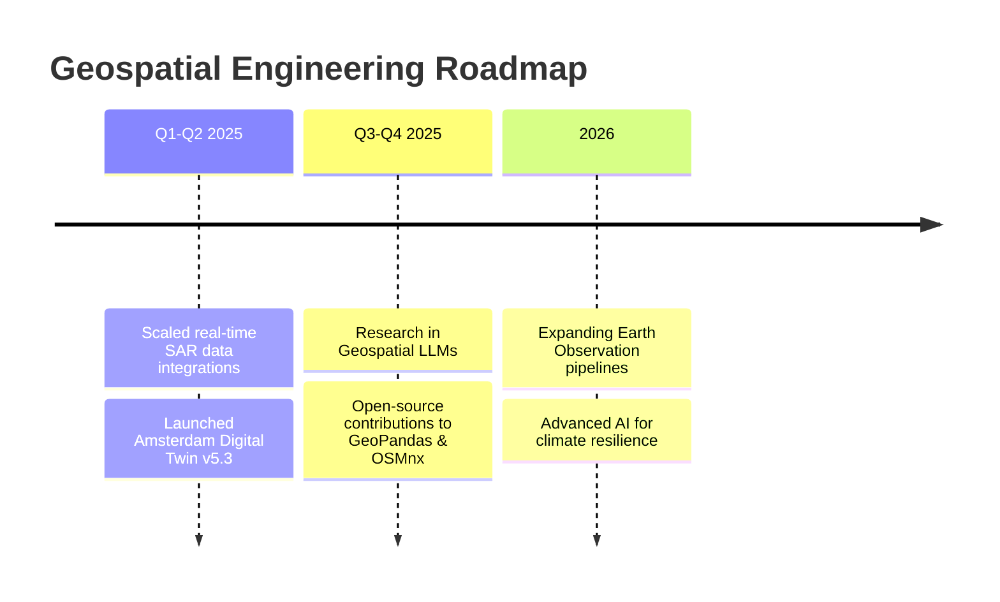

# 🌍 Ghulam Abbas Zafari

### MSc Geoinformatics Engineering · Geospatial AI & Earth Observation Specialist
**Politecnico di Milano** · 🎓 Graduated Oct 2025 · 📍 Milan, Italy

<p align="left">
  <a href="https://personal-website-gaz.onrender.com"></a>
  <a href="https://www.linkedin.com/in/ghulam-abbas-zafari-b94105248/"></a>
  <a href="mailto:ghulamabbas.zafari@gmail.com"></a>
</p>

> 🛰️ *“Every pixel tells a story of our changing planet. My mission is to decode these stories through rigorous machine learning and transform Earth Observation data into actionable intelligence for sustainable decision-making.”*

---

## 📊 GitHub Analytics Dashboard

<p align="center">
  
  
</p>

<p align="center">
  
</p>

<p align="center">
  
  
  
</p>

---

## ⚡ Technical Core

```text
       [ Earth Observation ] 🚀 Sentinel, Landsat, SAR Data Processing
                ▲
                │
 [ WebGIS ] ◄───┼───► [ Geospatial AI ] 🧠 Deep Learning, Computer Vision, PyTorch
                │
                ▼
       [ Urban Analytics ] 🏙️ Smart Cities, PostGIS, Network Routing

```

### 🛠️ Skill Matrix & Tools

| **Category** | **Technologies** | **Proficiency** |
| --- | --- | --- |
| **Languages & Core** | Python (GeoPandas, Shapely, Rasterio), SQL (PostGIS), JavaScript/TypeScript, R, HTML/CSS | ██████████ 95% |
| **Spatial Infrastructure** | QGIS, GRASS GIS, GeoServer, OpenStreetMap (OSMnx, NetworkX) | ██████████ 90% |
| **AI/ML & Frameworks** | PyTorch, TensorFlow, Scikit-learn, DBSCAN, Cluster Analysis | ██████████ 88% |
| **Full-Stack WebGIS** | FastAPI, Flask, Leaflet.js, Angular, Plotly, Bootstrap | ██████████ 85% |
| **DevOps & Cloud** | Docker, Kubernetes, Git Architecture, CI/CD Automations | ████████░░ 80% |

---

## 🏆 Featured Geospatial Engineering Projects

<table>
<tr>
<td width="50%">

### 🔥 Burned Area Detector (QGIS Plugin)
*Professional-grade spatial plugin for automated ecosystem monitoring*

**Stack:** `Python` `QGIS API` `Fuzzy Logic` `Sentinel-2`

<p>
  
  
  
</p>

```python
# Core logic snippet
def detect_burned_area(sentinel_image):
    # Fuzzy logic classification
    return burned_mask
```

</td>
<td width="50%">

### 🧠 Satellite Deep Learning Pipelines
*End-to-end framework for massive satellite imagery processing*

**Stack:** `PyTorch` `Rasterio` `GeoPandas` `Scikit-learn`

<p>
  
  
</p>

```python
# Model architecture
class LandslideDetector(nn.Module):
    def forward(self, x):
        return segmentation_mask
```

</td>
</tr>
<tr>
<td width="50%">

### 🏙️ Amsterdam Digital Twin (v5.3) & GeoIntelliSpace™
*Advanced WebGIS for complex 3D urban analytics*

**Stack:** `Angular` `FastAPI` `PostGIS` `GeoServer` `Leaflet` `Plotly`

<p>
  
  
  <a href="https://personal-website-gaz.onrender.com"></a>
</p>

</td>
<td width="50%">

### 🚲 Amsterdam Mobility & Transit Analyzer
*Network graph optimization & heat island correlation*

**Stack:** `OSMnx` `NetworkX` `GeoPandas` `DBSCAN`

<p>
  
  
</p>

</td>
</tr>
<tr>
<td width="50%" colspan="2">

### 🌸 Zan Digital Sanctuary
*High-availability humanitarian platform securing public support resources*

**Stack:** `Flask` `Bootstrap` `Python REST APIs`

<p>
  
  
  
</p>

</td>
</tr>
</table>

---

## 📂 Repository & Resource Distribution

<p align="center">
  
</p>

| Category | Repository Count | Core Technical Focus |
| --- | --- | --- |
| 📡 **Earth Observation & Remote Sensing** | 8 Projects | Sentinel/Landsat chains, SAR flood routing, time-series |
| 🏙️ **Urban Analytics & Smart Cities** | 6 Projects | Digital twins, microclimate indexing, network graphs |
| 🤖 **Artificial Intelligence & ML** | 6 Projects | Deep learning, computer vision, spatial clustering |
| 🌐 **WebGIS & Full-Stack Apps** | 5 Projects | High-performance spatial APIs, interactive web maps |
| 🛠️ **Geospatial Tools & Libraries** | 4 Projects | Specialized automation extensions, custom algorithms |
| 🌱 **Humanitarian & Climate Response** | 4 Projects | Scale data tracking, public health & sanctuary tech |

---

## 📈 Weekly Activity & Contribution Graph

<p align="center">
  
</p>

---

## 🚀 Professional Roadmap



---

## 🔥 Current Focus & Milestones

<p align="center">
  
  
  
</p>

---

## 📬 Connect & Collaborate

```text
🤝 Research: Deep Learning for Earth Observation  |  💻 Dev: High-Scale Spatial Pipelines
💼 Consulting: WebGIS & Cloud Architecture      |  🌱 Community: Open Source & Mentorship
```

<p align="center">
  <a href="https://personal-website-gaz.onrender.com"></a>
  <a href="https://www.linkedin.com/in/ghulam-abbas-zafari-b94105248/"></a>
  <a href="mailto:ghulamabbas.zafari@gmail.com"></a>
  <a href="https://github.com/ghulamabbaszafari"></a>
</p>

---

<p align="center">
  
  
  
</p>
