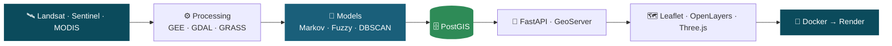
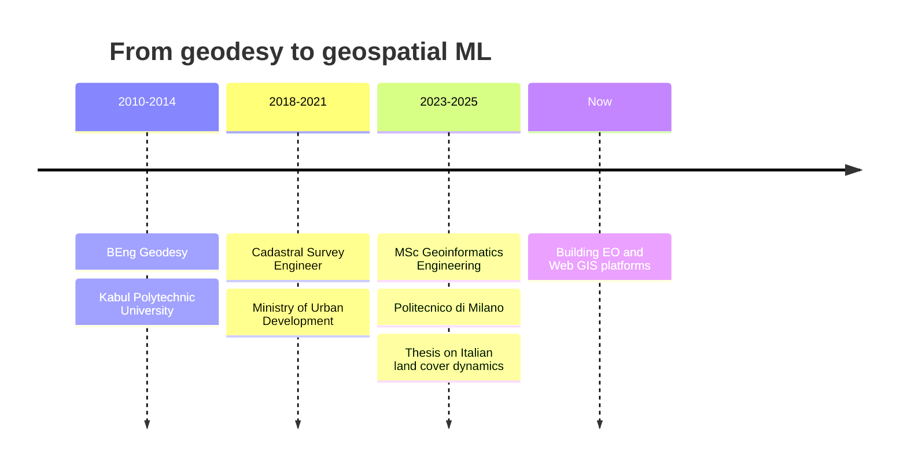

<!-- Save this as README.md in a repo named exactly: zafariabbas68/zafariabbas68 (public) -->

<div align="center">


<a href="https://github.com/zafariabbas68">
  
</a>

<br/>


[**Portfolio**](https://personal-website-gaz.onrender.com) &nbsp;·&nbsp; [**LinkedIn**](https://linkedin.com/in/ghulam-abbas-zafari-b94105248) &nbsp;·&nbsp; [**Email**](mailto:ghalambabas.zafari@gmail.com)

</div>

---

## 🌍 About

I turn satellite and geospatial data into **working software and clear answers**. My background spans geodesy and cadastral surveying (Kabul) and an MSc in **Geoinformatics Engineering at Politecnico di Milano**. Today I build end-to-end pipelines: acquisition → processing → ML → API → interactive map.

```python
class GhulamAbbasZafari:
    base        = "Milan, Italy"
    education   = ["MSc Geoinformatics Eng. (PoliMi)", "BEng Geodesy (Kabul Polytechnic)"]
    focus       = ["Earth Observation", "Land cover change", "Urban climate", "Web GIS"]
    data        = ["Landsat", "Sentinel-2", "MODIS", "Point clouds", "GML/XML"]
    currently   = "Shipping geospatial platforms & exploring EO + ML"
    ask_me_about = ["QGIS plugins", "PostGIS", "Markov chain LULC", "FastAPI + Leaflet"]
```

---

## 🧭 What I Do

| 🛰️ Earth Observation | 🧠 Machine Learning | 🗄️ Spatial Data Engineering | 🌐 Web GIS |
|:--|:--|:--|:--|
| Multi-temporal land cover analysis, LST, NDVI, burn severity | Markov chains, fuzzy logic, DBSCAN clustering | PostGIS, GeoServer (WMS/WFS), GML/XSLT, CRS handling | FastAPI back-ends, Leaflet / OpenLayers / Three.js front-ends |

---

## 🚀 Featured Projects

<table>
<tr>
<td width="50%" valign="top">

### 🛰️ GeoIntelliSpace
Geospatial intelligence platform: XML/GML validation, XSLT transformation, PostGIS, GeoServer, Dutch RD New (EPSG:28992).

`PostGIS` `GeoServer` `XSLT` `FastAPI`

[](https://github.com/zafariabbas68/GeoIntelliSpace-PLATFORM) [](https://geointellispace-platform.onrender.com)

</td>
<td width="50%" valign="top">

### 🔥 Burned Area Detector
QGIS plugin for wildfire analysis: fuzzy-logic detection, 7-class burn severity, SCL cloud/water masking, batch processing, confusion-matrix validation.

`QGIS` `PyQGIS` `Sentinel-2` `Fuzzy logic`

[](https://github.com/zafariabbas68/Burned-area-detection)

</td>
</tr>
<tr>
<td width="50%" valign="top">

### 🌾 AgriVision Hub
Crop health monitoring from drone/RGB imagery: GRVI calculation, health classification, async processing, Leaflet maps.

`FastAPI` `Leaflet` `Async` `Docker`

[](https://github.com/zafariabbas68/AgriVision-Hub---Geospatial-Crop-Health-Monitoring-Platform) [](https://agrivision-frontend.onrender.com)

</td>
<td width="50%" valign="top">

### 🌍 PCS-View
Point cloud viewer (Stonex-compatible): LAS / LAZ / E57 / PLY, distance and volume measurement, CAD export.

`Open3D` `Three.js` `Python`

[](https://github.com/zafariabbas68/PCS-View-Point-Cloud-Share-Viewer-) [](https://pcs-view.onrender.com)

</td>
</tr>
<tr>
<td width="50%" valign="top">

### 🏙️ Amsterdam Digital Twin
Smart-city platform: 3D city model, traffic simulation, air quality, Monte Carlo uncertainty, bootstrap CIs, nature-based-solution prioritisation.

`Python` `Monte Carlo` `3D` `Plotly`

[](https://github.com/zafariabbas68/Amsterdam-Digital-Twin---Smart-City-Platform)

</td>
<td width="50%" valign="top">

### 🌡️ Urban Heat Island, Lombardy
Landsat LST analysis with 30 m land cover, population vulnerability and NBS mitigation mapping. Peak urban–rural gap of **4.8 °C** over 238.75 km².

`Landsat` `GEE` `GeoPandas`

[](https://github.com/zafariabbas68/Urban-Heat-Island-Analysis)

</td>
</tr>
</table>

---

## 🏗️ How I Build


```mermaid
flowchart LR
    A[🛰️ Landsat · Sentinel · MODIS] --> B[⚙️ Processing<br/>GEE · GDAL · GRASS]
    B --> C[🧠 Models<br/>Markov · Fuzzy · DBSCAN]
    C --> D[(🗄️ PostGIS)]
    D --> E[🔌 FastAPI · GeoServer]
    E --> F[🗺️ Leaflet · OpenLayers · Three.js]
    F --> G[🚀 Docker → Render]
    style A fill:#0b4b5c,color:#fff,stroke:none
    style C fill:#1a5f7a,color:#fff,stroke:none
    style D fill:#2e8b57,color:#fff,stroke:none
    style G fill:#0b4b5c,color:#fff,stroke:none
```

---

## 🔬 Research & Analysis

| | Study | Highlight |
|:-:|---|---|
| 🇮🇹 | **MSc Thesis**: Land Cover Dynamics in Italy, 1985–2022 (ESA CCI 300 m + GLC_FCS30D 30 m) | Constrained Markov Chain, 79% accuracy, projection to 2032 |
| 🇧🇴 | **Bolivia NDVI**: 20-year vegetation time series | Amazon peak NDVI ≈ 0.85 |
| 🇬🇧 | **UK PM2.5**: 10 km grid sensitivity analysis | ±21% uncertainty; 0.433 µg/m³ reduction scenario |
| 🇪🇺 | **EuroPovertyMapper**: 327 NUTS-2 regions | 21.1% average risk; clear North–South divide |
| 🇳🇱 | **Amsterdam Mobility**: road and cycling network | 4,502 km roads, 1,481 km bike, density 0.889 |
| ✈️ | **Flight Network Analysis**: graph theory + environmental economics | $37M profit, 7.8M kg CO₂ |

---

## 🛠️ Tech Stack

<div align="center">


<br/><br/>


</div>

---

## 📊 GitHub Stats

<div align="center">


</div>

---

## 🎓 Journey


```mermaid
timeline
    title From geodesy to geospatial ML
    2010-2014 : BEng Geodesy : Kabul Polytechnic University
    2018-2021 : Cadastral Survey Engineer : Ministry of Urban Development
    2023-2025 : MSc Geoinformatics Engineering : Politecnico di Milano
              : Thesis on Italian land cover dynamics
    Now       : Building EO and Web GIS platforms
```

---

## 🌐 Live Demos

<div align="center">

[](https://geointellispace-platform.onrender.com)
[](https://agrivision-frontend.onrender.com)
[](https://pcs-view.onrender.com)
[](https://altimetrica.onrender.com)
[](https://geovision-frontend-ikof.onrender.com)
[](https://personal-website-gaz.onrender.com)

<sub>Hosted on Render's free tier, so the first load may take ~30 s to wake up.</sub>

</div>

---

## 📫 Let's Connect

<div align="center">

[](mailto:ghalambabas.zafari@gmail.com)
[](https://linkedin.com/in/ghulam-abbas-zafari-b94105248)
[](https://personal-website-gaz.onrender.com)

<br/>

*Open to collaborations in Earth Observation, environmental monitoring and geospatial software.*


</div>
